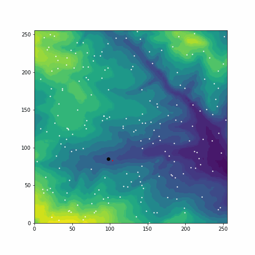

# Assignment 1: Agent Based Modelling 

## Outline

For this assignment I have built an agent based model which models sheep living in a field, eating grass and being relentlessly slaughtered by a rabid, insatiable wolf. The code imports in a digital elevation model which the sheep live on, and the sheep proceed to move around eating grass, sharing with sheep in their area. The sharing algorithm implemented ensures fair sharing regardless of the listed order of the agents by having a separate list of the shares going to each agent which are only shared out at the end of each iteration. The sheep walk around eating grass which does eventually run out, and they sometimes eat so much that they make themselves sick. 

The user is presented with a series of menus where they can choose:

- To use their own parameters or the default parameters
- To Use randomly placed agents or web scraped agent locations 
- To display the animation using the Tkinter GUI or to save the animation as a gif 

The parameters of the model include: 

- The number of agents (sheep)
- The number of iterations
- The walking speed of the sheep when not hunted 
- The running speed of the sheep when fleeing
- The wolf's speed
- The 'neighbourhood' -  the distance within which sheep will share their store with other sheep 

## Contents 

-[The main model](model3.py) - this is the one you want to run!

-[The sheep's framework](agentframework.py)

-[The wolf's framework](wolf_framework.py)

-[Some extra functions](myfunctions.py)

## Examples
Some examples that use speeds of 3,5 and 6 for eating sheep, fleeing sheep and the wolf, respectively. The neighbourhood limit is 50, the number of iterations is 100, and random locations are used. 

| 20 Sheep | 80 Sheep | 200 Sheep |
| --------------- | --------------- | --------------- |
|  |  |  |

## Issues and further development

- Although the model seems to work well, there has not been extensive testing. 
- The efficiency of the model has not been tested 
- Other features could be added to make the model more realistic e.g. reproduction, death, speed proportional to slope, day and night etc. 
- User interactivity could be added to the GUI rather than using the command line

## Licence 

[Here!](LICENSE)
